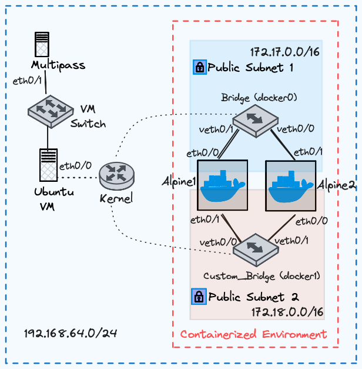

=============================
Architecture Deployment Guide
=============================

I have a simple architecture that deploys two docker containers in two different subnets. In docker, you can attach one container to several subnets. This is achieved by a new interface being created and assigned to that subnet.

.. list-table:: Network Architecture Table
   :widths: 25 25 25 50
   :header-rows: 0

   * - Device Name
     - Interface
     - IP Address
     - Subnet Mask
   * - Alpine1
     - eth0/0
     - 172.17.0.2
     - 255.255.0.0
   * - Alpine1
     - eth0/1
     - 172.17.0.4
     - 255.255.0.0
   * - Alpine2
     - eth0/0
     - 172.18.0.3
     - 255.255.0.0
   * - Alpine2
     - eth0/1
     - 172.18.0.5
     - 255.255.0.0
   * - Kernel/Ubuntu VM
     - eth0/0
     - 192.168.64.4
     - 255.255.255.0
   * - Multipass
     - eth0/1
     - 192.168.64.1
     - 255.255.255.0
   * - Bridge
     - docker0
     - 172.17.0.1
     - 255.255.0.0
   * - Bridge
     - veth0
     - --
     - --
   * - Bridge
     - veth1
     - --
     - --
   * - Custom_Bridge
     - docker1
     - 172.18.0.1
     - 255.255.0.0
   * - Custom_Bridge
     - veth0/0
     - --
     - --
   * - Custom_Bridge
     - veth0/1
     - --
     - --
  
Enter into Ubuntu Shell
=======================

Enter Into the Shell of the Ubuntu Server Again

.. code-block:: bash

   # Terminal-1 Mac/Linux
   multipass shell ubuntu
   Create a New Network

I noticed that in docker, you only specify a subnet and mask. This makes sense because if you are deploying this on AWS, a VPC will be defined already, all you need to do is create a new subnet mask for your containerized environment.

Create a Custom Bridge
======================

.. code-block:: bash

   # Terminal-1 Ubuntu
   docker network create \
   -o com.docker.network.bridge.name=docker1 \
   --subnet=172.18.0.0/24 \
   --gateway=172.18.0.253 \
   custom_bridge

Verify New Bridge
=================

.. code-block:: bash

   # Terminal-1 Ubuntu

   # This is a simulated command and output
   ubuntu@ubuntu:~$ docker network ls 
   NETWORK ID     NAME            DRIVER    SCOPE
   6e5ffkvms8c3   bridge          bridge    local
   d3b0029faed7   custom_bridge   bridge    local <==
   e9f55dsdf605   host            host      local
   e9708nj5179a   none            null      local

Pull Alpine Image
=================
I love using Alpine Linux because it's lightweight.

.. code-block:: bash
    
   # Terminal-1 Ubuntu
   docker pull alpine
   Open a New Terminal

Open New Terminal Tabs and Capture Packets in Each Bridge
===========================================================

docker0
-------
Execute this command to open a new tab. `⌘ + T`

Then enter the Ubuntu shell

.. code-block:: bash

   # Terminal-2 Mac
   multipass shell ubuntu
   Listen for ARP Packets in Each Bridge

Now that the Ubuntu shell has been initialized, execute the below command to capture all packets.

.. code-block:: bash

   # Terminal-2 Ubuntu
   sudo tcpdump -i docker0 -w capture_docker_0.pcap

Open a third terminal tab `⌘ + T`

docker1
-------
Execute another command to listen for all packets in the docker1 bridge interface.

.. code-block:: bash

   # Terminal-3 Ubuntu
   sudo tcpdump -i docker1 -w capture_docker_1.pcap

Create 2 Containers in the Default Bridge, Also Connect Them to the Custom Bridge
=================================================================================

Create 2 Containers in the Default Bridge
-----------------------------------------

.. code-block:: bash

   # Terminal-2 Ubuntu

   # Create containers in the default bridge
   docker run -itd \
   --name=alpine1 \
   --ip=172.17.0.2 \
   alpine

   docker run -itd \
   --name=alpine2 \
   --ip=172.17.0.4 \
   alpine

Connect Containers to Another Network
-------------------------------------

Connect new interfaces in the containers to another network.

.. code-block:: bash

    # Connect alpine1 to custom_bridge with IP 172.18.0.3
    docker network connect --ip=172.18.0.3 custom_bridge alpine1

    # Connect alpine2 to custom_bridge with IP 172.18.0.5
    docker network connect --ip=172.18.0.5 custom_bridge alpine2

Send Pings to the Internet From the First Interface
===================================================

Ping google.com four times in each container from `bridge`.

.. code-block:: bash

    # Ping from alpine1 with IP 172.17.0.2
    docker exec -it alpine1 ping -I 172.17.0.2 -c 2 google.com

    # Ping from alpine2 with IP 172.17.0.4
    docker exec -it alpine2 ping -I 172.17.0.4 -c 2 google.com

Send Pings to the Internet From the Second Interface
====================================================

Ping google.com four times in each container from `custom_bridge`.

.. code-block:: bash

    # Ping from alpine1 with IP 172.18.0.3
    docker exec -it alpine1 ping -I 172.18.0.3 -c 2 google.com

    # Ping from alpine2 with IP 172.18.0.5
    docker exec -it alpine2 ping -I 172.18.0.5 -c 2 google.com

.. _view_mac_addresses_of_each_bridge_interface:

View MAC Addresses of Each Bridge Interface
===========================================

View MAC addresses of Docker0 and Docker1 bridge interfaces.

..  Note::
   The Organizationally Unique Identifier (OUI) of all Docker network adapters is **02:42**. So expect all docker container MAC addresses to begin with that.

.. code-block:: bash

    # Terminal-1 Ubuntu
    ip --brief link | grep -E 'docker0|docker1' | awk '{print $1, $3}'

..  Note::
   Jump to :ref:`view_packet_captures` 

Output:

.. code-block:: bash

    docker0 02:42:28:a8:cb:f5
    docker1 02:42:7c:61:6d:f0

.. _view_mac_addresses_of_each_container_interface:

View MAC Addresses of Each Container Interface
==============================================

View MAC addresses of containers in `bridge` and `custom_bridge` networks.

Bridge network
--------------

.. code-block:: bash

    # Terminal-1 Ubuntu
    docker network inspect bridge --format '{{range .Containers}}{{.Name}}: {{.MacAddress}}{{"\n"}}{{end}}'

..  Note::
   Jump to :ref:`view_packet_captures` 

Output-1:

.. code-block:: bash

    alpine1: 02:42:ac:11:00:02
    alpine2: 02:42:ac:11:00:03

Custom bridge network
---------------------
.. code-block:: bash

    # Terminal-2 Ubuntu
    docker network inspect custom_bridge --format '{{range .Containers}}{{.Name}}: {{.MacAddress}}{{"\n"}}{{end}}'

Output-2:

.. code-block:: bash

    alpine1: 02:42:ac:12:00:03
    alpine2: 02:42:ac:12:00:05

End Packet Captures
===================

Packet Capture 1
----------------
Stop ARP packet capture in Terminal-2 Ubuntu.

.. code-block:: bash

    # Terminal-2 Ubuntu
    "control + c"

Packet Capture 2
----------------

Stop ARP packet capture in Terminal-3 Ubuntu.

.. code-block:: bash

    # Terminal-3 Ubuntu
    "control + c"

Move the Files to the Local Directory
=====================================

Move captured packet files to the local directory.

.. code-block:: bash

    # Terminal-1, 2, or 3 Ubuntu
    mv capture_docker_0.pcap /mnt
    mv capture_docker_1.pcap /mnt

